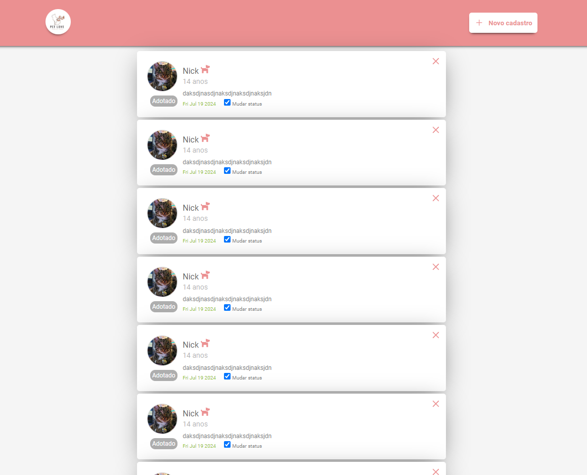
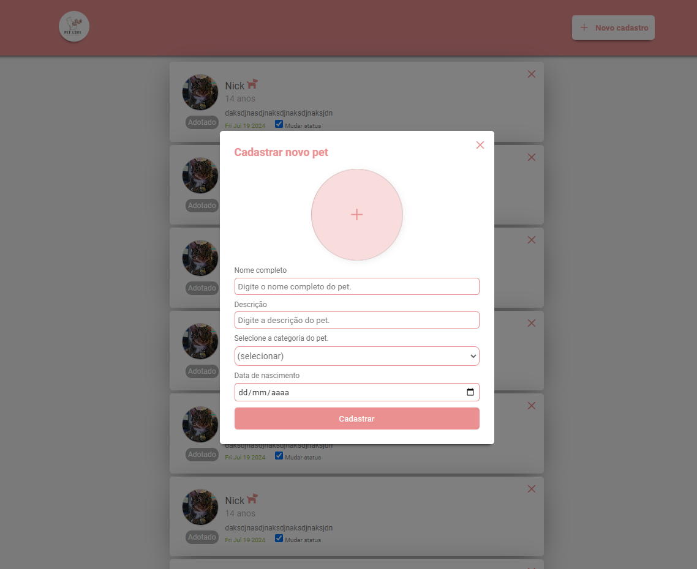
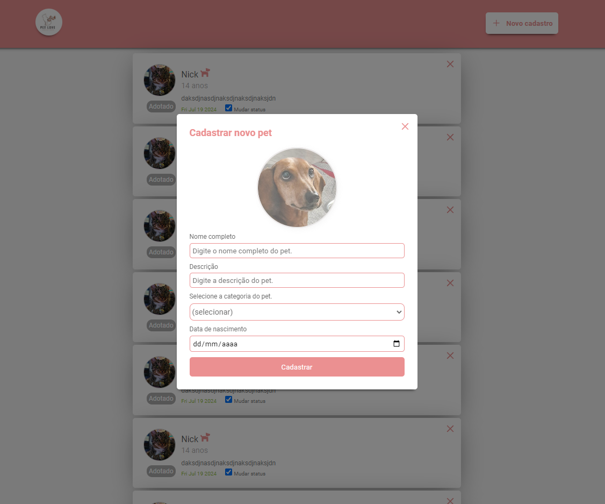
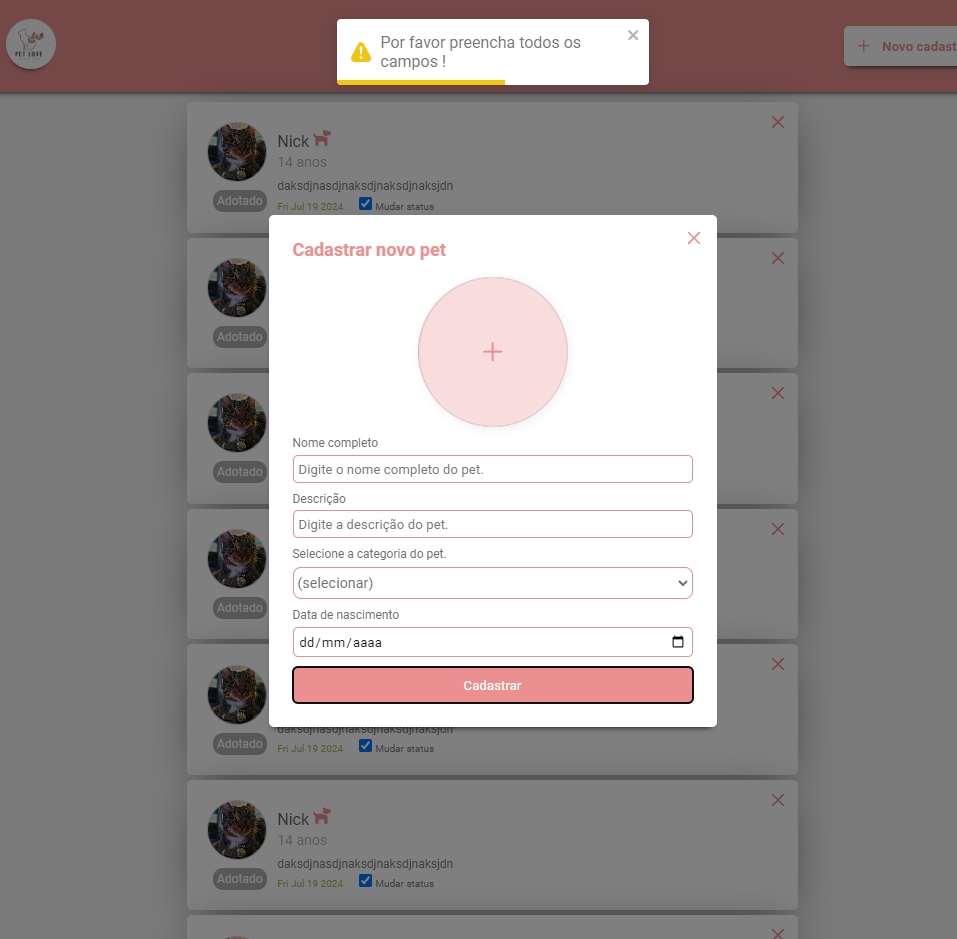

<h1 align="center" style="color: black;">
    
</h1>

---


# 📍 Indíce

- [📍 Indíce](#-indíce)
  - [🔖 Sobre](#-sobre)
  - [💻 Paginas](#-paginas)
  - [# Dashboard - Pets](#-dashboard---pets)
  - [# Cadastro - Pet](#-cadastro---pet)
  - [# Cadastro - Pet - Validation](#-cadastro---pet---validation)
  - [🚀 Tecnologias Utilizadas](#-tecnologias-utilizadas)
  - [🗂 Como instalar o projeto](#-como-instalar-o-projeto)
    - [🧔 Desenvolvedor](#-desenvolvedor)

---

## 🔖 Sobre

Aplicação desenvolvida para solução do Desafio

## 💻 Paginas

## # Dashboard - Pets

<h1 align="center">

  

</h1>

## # Cadastro - Pet

<h1 align="center">

  

</h1>

<h1 align="center">

  

</h1>

## # Cadastro - Pet - Validation

<h1 align="center">

  

</h1>

## 🚀 Tecnologias Utilizadas

O projeto foi desenvolvido utilizando as seguintes tecnologias

- [Back-end](https://github.com/Educolt/API_Adopt_Animals)
- [ReactJS](https://pt-br.reactjs.org/)
- [styled-components](https://styled-components.com/)
- [react-toastify](https://fkhadra.github.io/react-toastify/introduction)
- [Typescript](https://www.typescriptlang.org/)
- [axios](https://axios-http.com/docs/intro)

---

## 🗂 Como instalar o projeto

```bash
  # Clonar o repositório
  $ git clone https://github.com/Educolt/Website_Adopt_Animals

  # Entrar no diretório
  $ cd Website_Adopt_Animals

  # Instalar as dependencias
  $ npm install

  # Start App
  $ npm run start

```
⚠️ Atention: Antes de rodar o app, setar o valor da porta em que à api está rodando.

---

### 🧔 Desenvolvedor
Desenvolvido 💜 por Eduardo caldas Coutinho.
